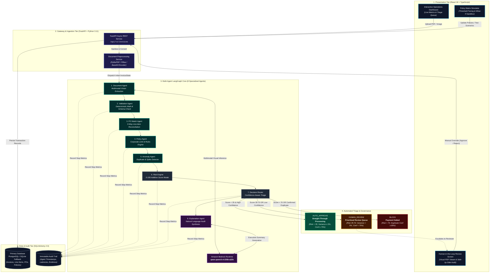

# InvoiceGuard AI — System Architecture & Workflow Diagram

This document outlines the end-to-end architecture of **InvoiceGuard AI**, an explainable multi-agent finance operations platform. It illustrates the interaction between the client dashboard, the asynchronous FastAPI gateway, the multimodal Amazon Bedrock foundation model (`qwen.qwen3-vl-235b-a22b`), the 8-agent LangGraph orchestration graph, and the persistent storage tier.

---

## 1. High-Level System Architecture

---

## 2. Multi-Agent LangGraph Linear & Conditional Execution Flow

```mermaid
sequenceDiagram
    autonumber
    actor User as Finance User / Vendor
    participant UI as React Frontend
    participant API as FastAPI Backend
    participant Graph as LangGraph Orchestrator
    participant Bedrock as Amazon Bedrock (Qwen3-VL)
    participant DB as Database / Audit Store

    User->>UI: Uploads Invoice (PDF/PNG)
    UI->>API: POST /api/v1/invoices/upload
    API->>API: Preprocess & Convert to High-Res Image
    API->>Graph: Invoke StateGraph(InvoiceState)

    rect rgb(24, 24, 48)
        note right of Graph: Agent 1: Multimodal Extraction
        Graph->>Bedrock: Send Document Image + JSON Schema Prompt
        Bedrock-->>Graph: Structured Data + Field Confidences (0.00-1.00)
    end

    rect rgb(20, 36, 36)
        note right of Graph: Agent 2: Deterministic Validation
        Graph->>Graph: Validate Arithmetic: (Subtotal + Tax == Total)
        Graph->>Graph: Validate Required Metadata & Currency Code
    end

    rect rgb(20, 36, 36)
        note right of Graph: Agent 3: 3-Way ERP Matching
        Graph->>DB: Query PO Record by po_number
        DB-->>Graph: PO Details & Line Item Catalog
        Graph->>Graph: Calculate Line-Item Price & Quantity Variances
    end

    rect rgb(20, 36, 36)
        note right of Graph: Agent 4: Policy Enforcement
        Graph->>DB: Fetch Active Corporate Policies
        DB-->>Graph: Approval Ceilings & Variance Tolerances
        Graph->>Graph: Flag Policy Exceptions (e.g., Variance > 5%)
    end

    rect rgb(20, 36, 36)
        note right of Graph: Agent 5: Anomaly & Duplicate Detection
        Graph->>DB: Query Historical Invoices (Vendor + Amount + Date)
        DB-->>Graph: Matching Invoices & Historical Spend Patterns
        Graph->>Graph: Compute Duplicate Probability & Spend Spike Z-Score
    end

    rect rgb(30, 30, 40)
        note right of Graph: Agent 6: Calibrated Risk Engine
        Graph->>Graph: Calculate Composite Risk Score (0–100)
    end

    rect rgb(30, 30, 40)
        note right of Graph: Agent 7: Confidence-Aware Decision Router
        Graph->>Graph: Evaluate Rules & Extraction Confidence (< 75% -> Escalate)
        Graph->>Graph: Set Decision: AUTO_APPROVE | HUMAN_REVIEW | BLOCK
    end

    rect rgb(24, 24, 48)
        note right of Graph: Agent 8: Audit Explanation Synthesis
        Graph->>Bedrock: Synthesize Natural Language Audit Brief
        Bedrock-->>Graph: Fact-Grounded Executive Summary
    end

    Graph->>DB: Commit Invoice Record & Immutable Audit Events
    Graph-->>API: Return Final Evaluated InvoiceState
    API-->>UI: Return Full Evaluation Response
    UI-->>User: Display Interactive Triage Card & Visual PDF Grounding
```

---

## 3. Component Architecture & Responsibility Matrix

| Layer | Component | Core Technology | Primary Responsibility |
|---|---|---|---|
| **Presentation** | Interactive Dashboard | React 18, Vite, TypeScript | Displays live throughput, triage metrics, and instant evaluation presets |
| **Presentation** | HITL Review UI | Tailwind CSS, Lucide React | Side-by-side visual PDF viewer with field grounding badges and reviewer actions |
| **Presentation** | Policy Simulator | Recharts, Axios | Interactive sandbox for finance admins to simulate policy impacts before production |
| **API Gateway** | REST Endpoints | FastAPI, Uvicorn | Request validation, asynchronous orchestration triggering, file streaming |
| **AI Foundation** | Vision Model | `qwen.qwen3-vl-235b-a22b` via Bedrock | Multimodal extraction with spatial bounding boxes and field-level confidence |
| **Multi-Agent** | LangGraph Pipeline | LangGraph `StateGraph` | Linear execution and state passing across 8 specialized agents |
| **Business Logic**| Deterministic Engines | Python 3.11, Pydantic v2 | Exact math validation, PO 3-way matching, duplicate detection, and risk scoring |
| **Persistence** | Relational & Audit DB| PostgreSQL / SQLite, SQLAlchemy | Stores invoices, PO records, active expense policies, and granular audit trails |

---

## 4. Key Architectural Pillars

1. **AI Interprets, Python Calculates:**
   - Visual understanding and semantic comprehension are delegated to **Qwen3-VL via Amazon Bedrock**.
   - Mathematical calculations (`subtotal + tax == total`), percentage variance tolerances, and policy ceilings are executed deterministically in **Python** with 0% hallucination risk.

2. **Confidence-Aware Human-in-the-Loop Routing:**
   - An invoice with zero math errors will still automatically route to `HUMAN_REVIEW` if any critical financial field extraction confidence falls below **75%**.

3. **Auditable Lineage:**
   - Every agent execution is permanently recorded with microsecond timestamps, latency benchmarks, input parameters, and exact evidence citations.
